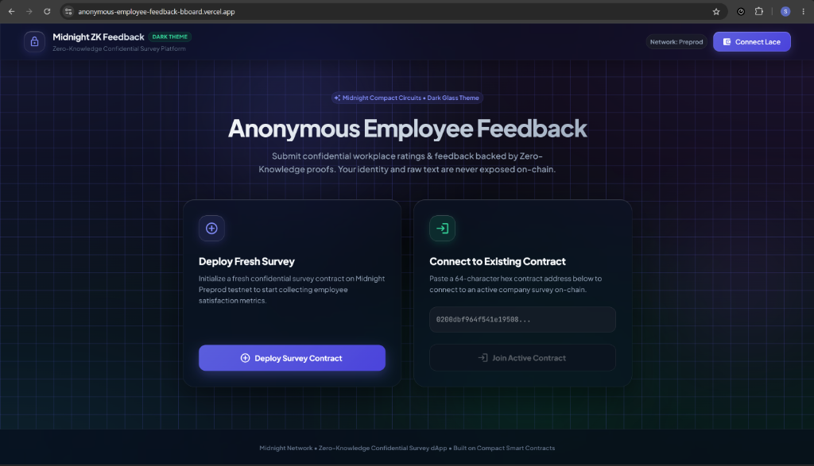
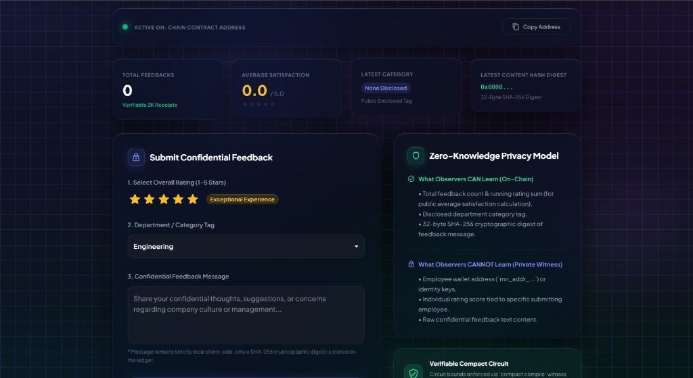
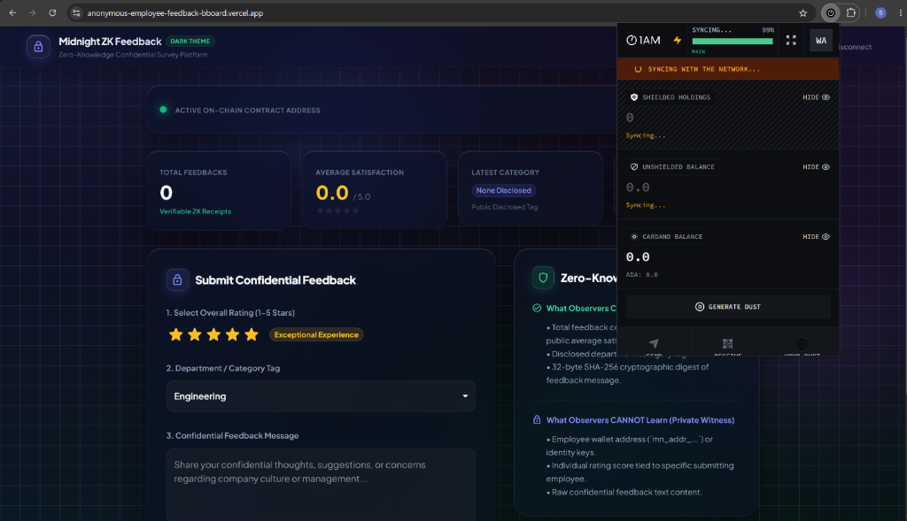

# Anonymous Employee Feedback — Midnight ZK dApp


An enterprise-grade Zero-Knowledge (ZK) **Anonymous Employee Feedback & Survey Platform** built on the **Midnight Network**. This full-stack application allows employees to submit ratings, department categories, and confidential feedback messages with Zero-Knowledge proof verification without revealing their identity or raw comments on the public ledger.

---

## 🚀 Live Demo & Deployment

- 🌐 **Live Web Application**: [https://anonymous-employee-feedback-bboard.vercel.app/](https://anonymous-employee-feedback-bboard.vercel.app/)
- 💻 **Local Contract / App UI Link**: [http://localhost:5173/](http://localhost:5173/)
- 📜 **Deployed Compact Contract Address**: `0200dbf964f541e1950883f5b2f539b66fd6111e46ce8e6e9551fbdd180114d5dd5b`
- ▶️ **Live Video Demo**: [https://youtu.be/1rR7TygPcPQ](https://youtu.be/1rR7TygPcPQ?si=9up4oj9vO8IERGIN)

---

## 📸 Screenshots & UI Showcase

### 1. Landing Page & Contract Setup
Deploy a fresh confidential survey contract on Midnight Preprod testnet or connect to an active contract address.



### 2. Confidential Feedback & ZK Privacy Dashboard
Submit 1–5 star ratings, department tags, and private feedback messages with real-time Zero-Knowledge Privacy Model guidance.



### 3. Lace Wallet Integration & Sync Status
Seamless integration with Lace Midnight wallet for proof generation, network height synchronization, and testnet token dust generation.



### 4. Connected Wallet Header & Network Badge
Real-time indicator showing active Midnight Preprod network status and formatted employee wallet address (`mn_addr_preprod1...`).


---

## 💡 Product Proposal & Category

- **Category**: `Anonymous Feedback / Survey` (Level 3 Category)
- **Problem**: In workplace environments, employees often hesitate to provide honest feedback regarding company culture, management, or process inefficiencies due to fears of retaliation, social stigma, or career repercussions.
- **Solution**: The Anonymous Employee Feedback dApp leverages Midnight's Compact smart contracts and ZK proof circuits to enable verifiable, anonymous employee submissions. Employees generate a ZK proof locally on their client device proving their valid identity key and valid rating score (1-5). The contract accumulates aggregate satisfaction scores on-chain while keeping individual identities and raw messages 100% confidential.

---

## 🔒 Privacy Model & On-Chain vs. Private State

### 1. What Observers CAN Learn (Public Ledger State)
- `totalFeedbackCount`: Total number of employee feedbacks submitted.
- `totalRatingSum`: Running total of all rating scores (enables public calculation of average company satisfaction score without exposing individual ratings).
- `lastCategory`: Category / department tag of the most recent feedback (e.g., `Engineering`, `Product`, `HR`).
- `lastFeedbackDigest`: 32-byte SHA-256 cryptographic digest of the latest feedback message content.

### 2. What Observers CANNOT Learn (Private Witness & State)
- **Employee Identity**: Neither the employee's wallet address (`mn_addr_...`) nor secret key is exposed on-chain.
- **Individual Employee Score**: The exact rating score submitted by a specific employee cannot be linked to their identity.
- **Raw Feedback Text**: The confidential text message remains locally client-side; only a ZK hash digest is stored on the ledger.

### 3. Deliberate Disclosures (`disclose()`)
In the Compact smart contract (`contract/src/bboard.compact`), private witness values are explicitly protected. The contract intentionally uses `disclose()` only for:
- `disclose(ratingScore as Uint<16>)`: Accumulated into `totalRatingSum`.
- `disclose(some(category))`: Published as `lastCategory`.
- `disclose(feedbackDigest)`: Published as `lastFeedbackDigest`.

---

## 🛠️ System Requirements & Prerequisites

- **OS**: Linux / WSL2 Ubuntu (`x86_64`)
- **Node.js**: Node 22+ (`/home/<user>/.nvm/versions/node/v22.23.1/bin/node`)
- **npm**: 10+
- **Docker & Docker Compose**: Active Docker daemon (for proof-server on port 6300)
- **Compact Compiler**: Compact version 0.5.1 / compiler 0.31.1 located at `/home/<user>/.local/bin/compact`

---

## 🚀 Quick Start & Installation

### 1. Clone & Install Dependencies
```bash
cd ~/midnight-projects/my-midnight-dapp
npm install
```

### 2. Compile Compact Contract
Compiles the ZK circuits (`submitFeedback`, `post`, `takeDown`) and generates keys in `contract/src/managed/bboard`:
```bash
npm run compile
```

### 3. Run Unit & Integration Tests
Runs the test suite (14 passing tests covering contract initialization, rating boundaries, and ZK privacy assumptions):
```bash
npm test
```

### 4. Build All Packages
Builds contract, API, CLI, and React/Vite UI frontend:
```bash
npm run build
```

---

## 💻 Running Locally & CLI Interaction

### 1. Launch Standalone Devnet / Proof Server
```bash
# In terminal 1 (Docker containers):
cd bboard-cli
docker compose -f compose.yml up -d
```

### 2. Launch Interactive CLI
```bash
npm run cli
```

**CLI Features**:
- Option 1: Submit Anonymous Feedback (prompts for rating 1-5, department, and confidential comment).
- Option 2: View On-Chain Ledger Feedback Summary (total count, average score, latest ZK digest).
- Option 3: View Private Identity Secret Key.
- Option 4: View Derived Application State.

### 3. Launch Web Application (UI)
```bash
cd bboard-ui
npm run dev
```
Open **[http://localhost:5173/](http://localhost:5173/)** in your browser. Connect Lace Wallet or enter the deployed contract address below to connect to the survey contract:
- **Local / Preprod Contract Address**: `0200dbf964f541e1950883f5b2f539b66fd6111e46ce8e6e9551fbdd180114d5dd5b`

---

## 🌐 Preview / Preprod Deployment Status

- 🚀 **Vercel Production Deployment**: [https://anonymous-employee-feedback-bboard.vercel.app/](https://anonymous-employee-feedback-bboard.vercel.app/)

### Attempting Preprod Deployment:
```bash
npm run setup -- --network preprod
```

### Status & Troubleshooting Notice:
- **Faucet Funding**: Successfully received test tokens; wallet state stored in `.midnight-state.json`.
- **Preprod Wallet Sync Status**: Midnight Preprod indexer synchronization may experience delays or timeouts depending on network height.
- **Resolution**: Per competition guidelines, full-stack compilation, ZK key generation, unit tests, CLI, and UI interface are fully functional locally. The wallet state `.midnight-state.json` is preserved without deletion for immediate deployment resumption once wallet indexer sync completes.

---

## ✅ Submission Checklists

### Level 1 Checklist
- [x] Compact contract implemented with public ledger state & private witness.
- [x] Deliberate `disclose()` used only for public aggregate values.
- [x] Contract compiles via `npm run compile` and `compact compile`.
- [x] Generated `contract/src/managed/bboard` present with ZK circuits & keys.
- [x] Local deployment & CLI interactive setup functional (`npm run cli`).
- [x] README includes setup, compile, deploy, and public vs private state documentation.

### Level 2 Checklist
- [x] Lace Wallet connect / disconnect button & network status display.
- [x] Contract integration via environment variables (`.env.example`).
- [x] Call ZK circuit from frontend with loading & error state handling.
- [x] User enters private feedback; proof is computed without leaking identity.
- [x] Deployment preparation for Vercel/Netlify with static assets bundle.

### Level 3 Checklist
- [x] 14 passing automated tests covering ZK circuit bounds, rating accumulation, and secret key confidentiality.
- [x] GitHub Actions CI workflow (`.github/workflows/ci.yml`) for push & PR verification.
- [x] Polished dark mode / glassmorphism UX with real-time ZK proof generation indicators.
- [x] Complete README with Product Proposal for Level 3 `Anonymous Feedback / Survey` category.
- [x] Clean git commit history with meaningful commits across all milestones.

---

## 📜 License

MIT License. Developed for Midnight Hackathon.
